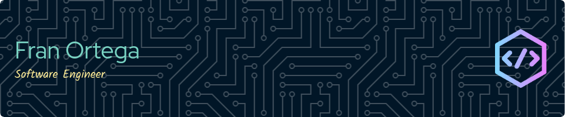

<h1 align="center">Hi, I'm Fran Ortega </img></h1>

  

<!--Banner-->

  

 

## <picture></picture> About me
💡 &nbsp;I like to explore new technologies and develop software solutions.\
🎓 &nbsp;I'm on track for learning more about Artificial Intelligence, Systems Design, and Cloud Architecture.\
🌱 &nbsp;I'm a firm believer in the importance of continuous learning and development, and I am excited to keep expanding my knowledge in the field.\
✍️ &nbsp;In my free time, I pursue Graphic Design and BIM Modeling as hobbies.\
💬 &nbsp;Feel free to reach out to me for some interesting discussion.\
 
<!--tech stack icons-->
<h2>Stack</h2>
 

  

 

### ⚙️ &nbsp;GitHub Analytics

 

<!--Contribution Graph-->

    

 
<!--Contact Section-->
<h2 align="center"> Cᴏɴɴᴇᴄᴛ Wɪᴛʜ Mᴇ </h2>

    
    
    
    

 

